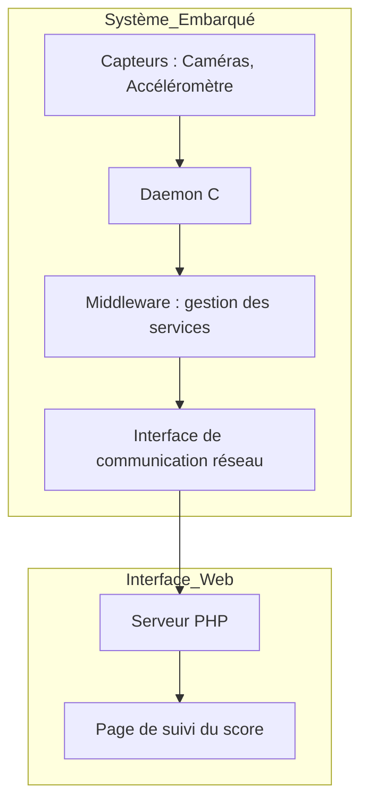

## 🧱 Architecture logicielle

```mermaid
flowchart TD
    subgraph Système_Embarqué
        A[Capteurs : Caméras, Accéléromètre]
        B[Daemon C]
        C[Middleware : gestion des services]
        D[Interface de communication réseau]
    end

    subgraph Interface_Web
        E[Serveur PHP]
        F[Page de suivi du score]
    end

    A --> B --> C --> D --> E --> F
```